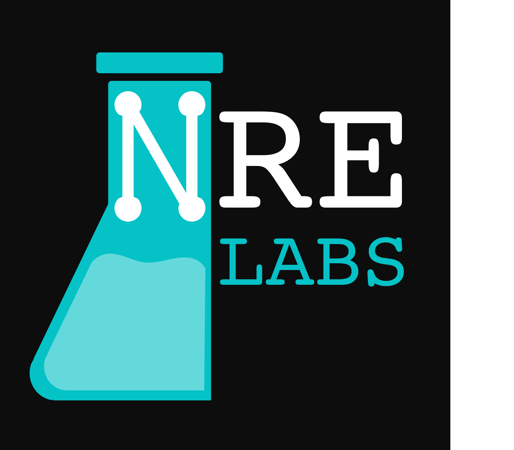

.. _nrelabs:

NRE Labs
================================

`NRE Labs <https://labs.networkreliability.engineering/>`_ is the flagship
and reference deployment of Antidote.

While NRE Labs aims to be intuitive to use without documentation, lab
contributors and Antidote developers should familiarize themselves with
concepts of the learning curriculum and in the future, gamification.

Taxonomy
---------------

In the NRE Labs curriculum there are several courses. A course is a theme and
grouping of many related lessons. A lesson is a common task or workflow of
many small steps. A lab is one small step or several that can be explained
easily so that a user can understand and accomplish the labs in a matter of
minutes.

Here is the hierarchy overview:

* Curriculum: the whole thing (NRE Labs)
* Course: Like a category or topic of study
* Lessons: A set of exercises that make sense together to teach something with
  a common set of resources. Usually a NetOps task.
* Labs (also known as stages): A set of related steps forming a workflow in a Lesson

Lesson and Lab Relationship
------------------------------

NRE Labs is supposed to be fast, easy and fun to use.  Labs should not take
long to complete, so a Lesson is usually made up of a handful or more Labs.

Lessons are designed to solve a problem various ways to maximize learning. It
is helpful to think of solving the same workflow different ways with different
kinds of Labs. That way in one Lesson or Course we teach several ways of doing
something, and different skills. We can reason about automating workflows
into a Lab in the following ways:

* On-box and Off-box
* Single or Multi step
* Single or Multi node
* Going direct-to-box or going through an higher-level controller or collector
* Sequential/Serial/Synchronous or In-Parallel/Asynchronous (like map-reduce)

Courses
------------

While in the initial release of NRE Labs, we’ll only have a few Courses,
eventually we’ll have more. Recall that a Course is a theme or grouping of many
related Lessons.

Here is a list of Courses currently under consideration and development:

#. Troubleshooting and Common Tasks
#. Configuration
#. Telemetry
#. Security
#. Testing and Validation
#. Infrastructure as code
#. Event-driven infrastructure

NRE Labs Roadmap
---------------------------

The curriculum roadmap for NRE Labs will evolve separately from the roadmap and
releases of the Antidote infrastructure. In general as infrastructure matures,
the curriculum will release more frequently with new expansions.

If you want to propose a Lesson or build one yourself, please refer to the
project's contributing guide and search the
`issues <https://github.com/nre-learning/antidote/issues>`_ before you create a
new enhancement- and curriculum-labelled issue. If you know which course it
matches, then try to find the appropriate label for it, or indicate it in the
description. The team welcomes and values your suggestions and contributions.
