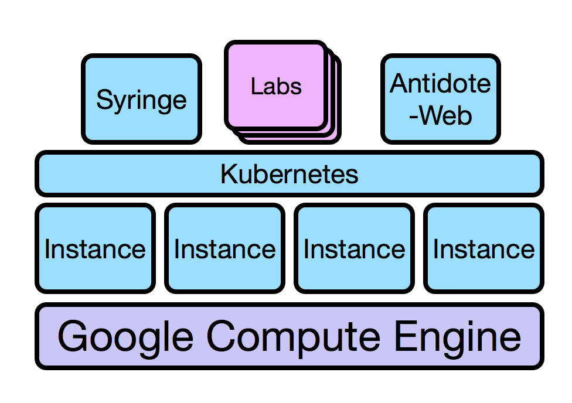

Roadmap
================================

This is a very fast-moving project, and it's important that explain clearly where we are planning to get in certain
milestones, especially as we progress towards the first demonstrable version.

This very first version, v0.1 - will be pretty close to alpha quality. Though we obviously want to provide a project
that works end-to-end, we'll have incur a bit of technical debt and make certain tradeoffs to get there.

To provide context around these decisions, this document will address three main questions:

- What will v0.1 look like?
- What will it take to get there?
- What are we punting for future versions?

What will Antidote v0.1 look like?
----------

First, let's explain the capabilities that this very first version of Antidote will have. Note that this will be a
fairly lengthy list, primarily because all of the underlying infrastructure is being defined from scratch in this
version. Future versions will ideally focus much less on this layer, and much more on the applications that drive
Antidote. Out of necessity, v0.1 will address both.

First, let's quickly overview the various tiers that will make up the Antidote solution:

+----------------------+--------------+--------------------------------------------------------------------------+ 
| Infrastructure Tier  | Tool Used    |                              Explanation                                 | 
+======================+==============+==========================================================================+ 
| Cloud Infrastructure | Terraform    | All cloud infrastructure elements (instances, DNS entries,               |
|                      |              | load balancers, etc) are defined in terraform files. This lets           |
|                      |              | us use infrastructure-as-code workflows to quickly                       |
|                      |              | create/delete/change infrastructure elements.                            | 
+----------------------+--------------+--------------------------------------------------------------------------+ 
| VM Configuration     | Ansible      | Once Terraform provisions the cloud resources, like instances, they need |
|                      |              | to be configured, such as having dependencies installed, configuration   |
|                      |              | files written, processes restarted, etc. We use an Ansible playbook to   |
|                      |              | initially configure all GCE instances, including those that are added to |
|                      |              | the compute cluster to respond to a scaling event.                       | 
+----------------------+--------------+--------------------------------------------------------------------------+ 
| Container Scheduling | Kubernetes   | We use Kubernetes drive much of the cluster management. When we want to  |
|                      |              | provision a resource as part of a lab, today we do this by interacting   |
|                      |              | with kubernetes.                                                         | 
+----------------------+--------------+--------------------------------------------------------------------------+ 
| Lab Provisioning     | Syringe      | Kubernetes is still fairly low-level for our purposes, and we don't want |
|                      |              | to place the burden on the lab contributor to know how kubernetes works. |
|                      |              | So we developed a tool called Syringe that ingests a very simple lab     |
|                      |              | definition, and pushes the necessary definitions to Kubernetes. It also  |
|                      |              | provides an API for the web front-end (antidote-web) to know how to      |
|                      |              | provision and connect to lab resources.                                  | 
+----------------------+--------------+--------------------------------------------------------------------------+ 
| Web Front-End        | antidote-web | We developed a custom web application based on Apache Guacamole which    |
|                      |              | presents a web front end that includes an in browser terminal            |
+----------------------+--------------+--------------------------------------------------------------------------+ 

We decided to use our own DIY Kubernetes as opposed to a hosted Kubernetes solution for a few reasons:

- We needed a custom CNI plugin (multus), which GKE doesn't allow us to do.
- We wanted this to be portable - we could replace the cloud insfrastructure layer with another cloud provider, or perhaps
  an on-premises solution, and not have to do a lot of work to make it happen.
- We needed to be able to offer nested virtualization, as this is how the vMX runs in a container today. In Google cloud,
  or in any on-premises hypervisor, this is done at the image layer. With GKE, this wouldn't be possible.

So, version v0.1 will provide the following:

- All infrastructure will be provisioned by Terraform
- Instances provisioned by Terraform will be configured by Ansible
- Kubernetes will be installed by Ansible and will take care of scheduling higher-level applications on to the instances
  as needed
- Syringe will provide key middleware functionality of scheduling labs via the Kubernetes API when a user logs in
  to the lab page, but also provide an API for that page to get connectivity information. All lab provisioning will take
  place in real-time, in response to the user interacting with the lab web front-end.
- Antidote-web will provide a way for users to interact with the lab, entirely in the browser. This will include at a minimum
  the terminal pane to interact with a Junos or Bash CLI, as well as a Jupyter notebook. Other functionality may be considered in the future.

What will it take to get to v0.1?
----------

- Web front end needs to be finished. We have to allow users to click on a tab
  to get to another device in the lab. We also have to finish any theme work, and we also still have to build a web page for each lab today
  We also need to give a pop up (https://getbootstrap.com/docs/4.0/components/modal/) that explains the lab is being provisioned when they first get to the page. Finally we have to provision a cookie
  so we can track the session
- We need to finish Syringe. It is currently able to provision resources in Kubernetes, but this hasn't been wired up to its API to
  perform this provisioning in response to a user logging in to the site. 

What are we postponing for future versions?
----------

- More than just guacamole and Jupyter
- Automatically rendering lab pages rather than having to do it statically each lab
- GUI for putting together lab files

TOADO

Need to be able to provide default configs as part of the lab definition. Can't require people to bake up their own images no matter what

Don't reset tunnels when you click on another tab. Preserve the tunnel history.

Each lab also needs a diagram and a description/walkthrough of the lab, in addition to any jupyter style walkthrough

each lab needs tags and categories (latter for navbar)

Labs HTML files should be jinja2 templates and you should render them when you build the webapp. Should write a python script to do this, driven by
syringefiles.